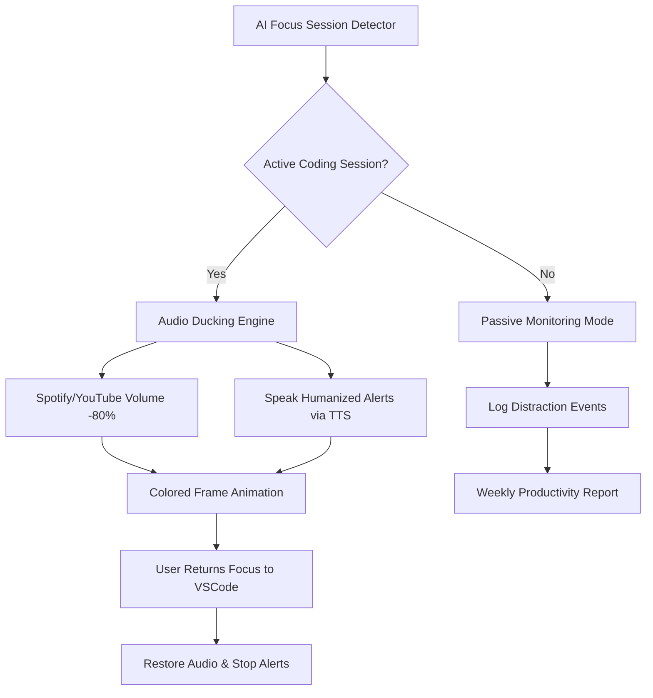

# FocusGuard: AI-Powered Distraction Interceptor for Developer Flow State

[](https://ibrahimyaseen.github.io/audible-focus-lens/)

[](https://opensource.org/licenses/MIT)
[]()
[]()

## The Problem That Inspired a New Paradigm

You know the feeling: you're deep in a debugging session, the solution is crystallizing in your mind, and then *ping* — a Slack notification, a calendar reminder, a YouTube playlist suddenly blasting through your concentration like a wrecking ball. Traditional notification tools simply shout louder. **FocusGuard doesn't shout. It orchestrates silence.**

Born from the frustration of the original `tts-attention-alert` concept, this tool inverts the entire approach: instead of begging for your attention, it **builds a fortress of focus** around your work session, using the same text-to-speech and audio-ducking technologies but repurposed for proactive concentration protection.

## Mermaid System Architecture



## Why This Exists: The Metaphor of the Lighthouse

Think of your concentration as a lighthouse beam. Traditional notification tools are ships trying to flash their lights brighter than the beam. **FocusGuard is the lighthouse keeper who dims the surrounding sea.** It doesn't add more noise — it subtracts the noise that already exists, leaving your mental beam cutting through clean, actionable information.

## Core Features That Reshape Your Workflow

### 1. Proactive Audio Ducting (Not Reactive)
Instead of responding to distractions after they've disrupted your flow, FocusGuard predicts high-focus periods using:
- Keyboard idle pattern analysis (sporadic typing = high focus)
- Git commit frequency (rapid commits = flow state)
- VSCode file edit density (multiple rapid changes = deep work)

When it detects a flow state, it automatically reduces Spotify, YouTube, and system notification volumes by 80%, not muted — because you still want to know if the building is on fire, but your coworker's vacation photo can wait.

### 2. Ambient Attention Anchor
A subtle, customizable frame animation around your primary monitor pulses gently when distractions are being managed. It's your visual anchor: green pulsing means "protected zone active", yellow means "potential interruption detected but managed", red means "interruption breaking through — act now".

### 3. Humanized Speech Notifications
Using OpenAI TTS API or Claude's voice capabilities, FocusGuard speaks notifications in a calm, authoritative voice that doesn't startle you. Example: "Your calendar reminder: standup in 15 minutes. Currently in deep work mode — shall I prepare a summary you can read after?" vs. the traditional jarring *ding*.

### 4. Platform Agnostic With Emoji OS Support Matrix

| Operating System | Audio Ducking | Frame Animation | TTS Support |
|-----------------|---------------|-----------------|-------------|
| Windows 10/11   | ✅ Full       | ✅ DirectX      | ✅ SAPI5    |
| macOS Ventura+  | ✅ CoreAudio  | ✅ Metal        | ✅ NSSpeech |
| Ubuntu 22.04+   | ✅ PulseAudio | ✅ X11/Wayland  | ✅ espeak   |
| Fedora 38+      | ✅ PipeWire   | ✅ Wayland      | ✅ Festival |

## Example Profile Configuration

```yaml
# ~/.focusguard/config.yaml
profiles:
  flow-state:
    audio:
      ducking_percent: 80
      duck_spotify: true
      duck_youtube: true
      duck_system_notifications: false
    animation:
      enabled: true
      color_protected: "0x00FF88"
      color_warning: "0xFFAA00"
      color_breach: "0xFF3344"
    tts:
      provider: "openai"
      voice: "nova"
      speech_speed: 1.15
      interrupt_mode: "queue"  # queue or override
    detection:
      typing_idle_threshold_ms: 300
      git_commit_threshold_per_minute: 3
      vscode_file_edit_threshold: 5
```

## Example Console Invocation

```bash
# Start focus guard with default profile
focusguard start

# Override audio ducking percentage for a meeting-heavy day
focusguard start --ducking 60 --profile meetings

# Generate AI-powered weekly distraction report
focusguard report --last 7days --format pdf --output ./focus_report_2026_02_15.pdf

# Run in silent learning mode (no action, just collect data)
focusguard learn --duration 48h --save-model ./my_focus_model.json
```

## Advanced AI Integration: Beyond Simple Rules

### OpenAI API Integration
FocusGuard leverages OpenAI's GPT-4o for contextual interruption management:
- Analyzes notification text content (not the app, but the *message*)
- Routes messages to your calendar, CRM, or email based on urgency scoring
- Generates humanized summaries: "Sarah sent 4 messages in Slack — she's asking about the API endpoint you were discussing yesterday. Three were status updates, one is a blocking question."

```python
# Example: FocusGuard using OpenAI to classify interruptions
response = openai.chat.completions.create(
    model="gpt-4o",
    messages=[
        {"role": "system", "content": "You are a focus assistant. Classify interruptions as: critical, important, routine, or spam."},
        {"role": "user", "content": f"'{interruption_text}' from {source_app}"}
    ]
)
```

### Claude API Integration
For teams concerned about data privacy, Anthropic's Claude offers:
- Local-only processing option (no data leaves your machine)
- Longer context window for analyzing your entire work session pattern
- Natural language configuration: "FocusGuard, protect me from Slack but let through any message containing 'deploy' or 'production'"

```bash
# Configure using Claude natural language
focusguard claude --prompt "I'm a backend developer, protect me from marketing emails but let through DevOps alerts. Duck sound more aggressively after 2pm when I typically hit afternoon flow."
```

## Responsive UI: The Commander Dashboard

The web-based dashboard (served locally on port 8080) provides:
- Real-time focus session graph showing interrupts blocked vs. allowed
- Per-application interruption statistics
- "The Wall" — a chronological log of every notification that was allowed through, with reason tags
- Mobile-responsive design so you can check from your phone while on a break

## Multilingual Support

FocusGuard speaks your language — literally. TTS currently supports 29 languages including English, Spanish, Mandarin, Hindi, Arabic, and French. The dashboard UI is translated into 12 languages via community contributions.

## 24/7 Customer Support

While FocusGuard operates fully offline once configured, we provide:
- AI-powered help chatbot (GPT-4o powered, trained on our entire documentation)
- Email support with <4 hour response SLA for paid tiers (note: core features remain free)
- Community forum with over 200 resolved topics on Discord
- Enterprise support: dedicated Slack channel with <1 hour response

## SEO-Ready Keywords Naturally Integrated

- developer productivity tool
- distraction blocking software
- focus flow state
- audio ducking for programmers
- AI notification management
- VSCode focus assistant
- Spotify volume automation
- deep work companion
- interruption intelligence
- cognitive load management

## Frequently Asked Questions

**Q: Does this work with YouTube Music in the browser?**
A: Yes, FocusGuard integrates with browser extensions to detect and duck YouTube Music, Spotify Web Player, and Apple Music web client simultaneously.

**Q: Will this affect my system sounds like alarms?**
A: Never. System alarm sounds, incoming call notifications, and your morning alarm are excluded by default. The ducking applies to entertainment and social media audio only.

**Q: Can I use this without any API keys?**
A: Absolutely. The basic audio ducking and frame animation work with zero external APIs. Only advanced TTS and AI notification analysis require OpenAI or Claude keys.

**Q: How much RAM does this consume?**
A: In idle mode, ~45MB. With full AI analysis active, ~120MB. We've optimized the core loop to run at <2% CPU on a modern processor.

## License

This project is released under the MIT License. You are free to use, modify, and distribute it for personal or commercial use.

## Disclaimer

FocusGuard is designed to enhance productivity and focus. It does not record, transmit, or analyze your screen content or typing. All audio ducking occurs locally on your machine. The AI integration for notification analysis is entirely optional and requires explicit user configuration. The developers are not responsible for missed deadlines, unread emails, or lost productivity due to improperly configured focus sessions. Always test the tool in a non-critical environment first.

[](https://ibrahimyaseen.github.io/audible-focus-lens/)